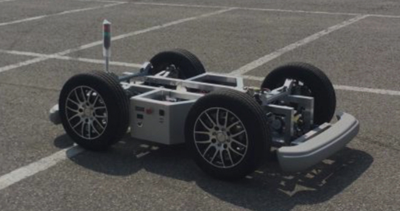

# ERP-CAN
[ERP42](http://www.unmansol.com/sub07_en.html#none) control panel with QT/QML 

>  ERP42 stands for Education Robot Platform and it is the educational platform of vehicle type that the students and researchers can easily test vehicle control, fusion of sensors and self-driving algorithm by replacing real vehicle platform as it have the similar driving, steering and break system to the real one

<left></left>

## Dependency

- Ubuntu 18.04

- QT 5.12.9

- PCAN-Driver for Linux 

  

## Usage

~~~shell
$ cd ERP_Control
$ mkdir build && cd build
$ qmake ..
$ make 
$ ./ERPControl
~~~

